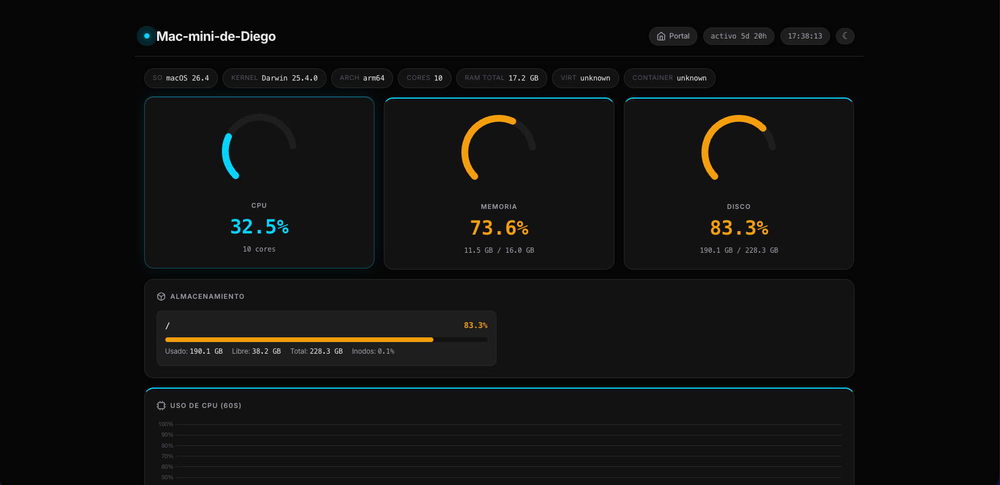
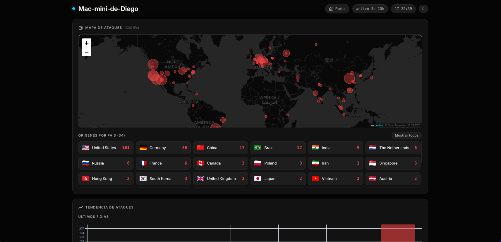
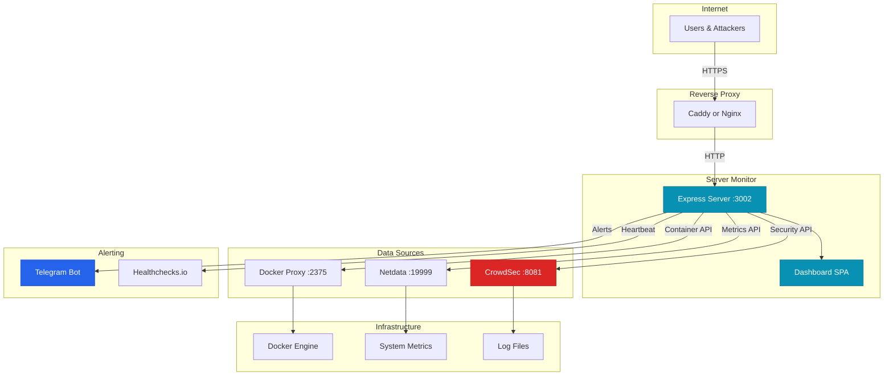
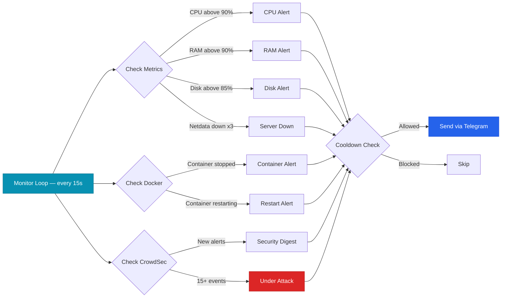
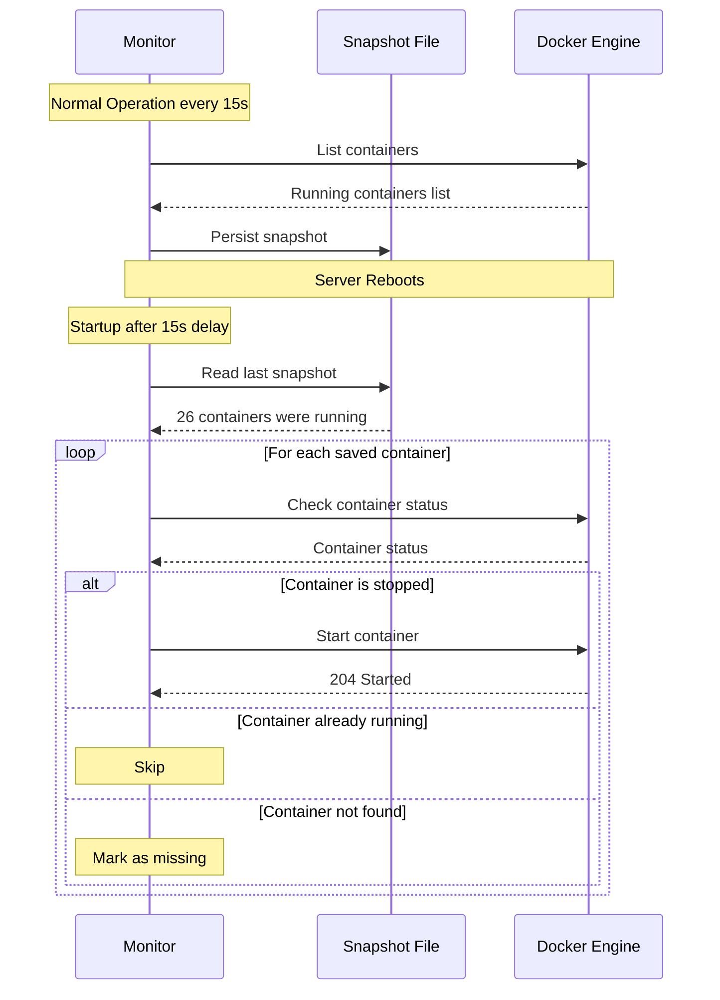
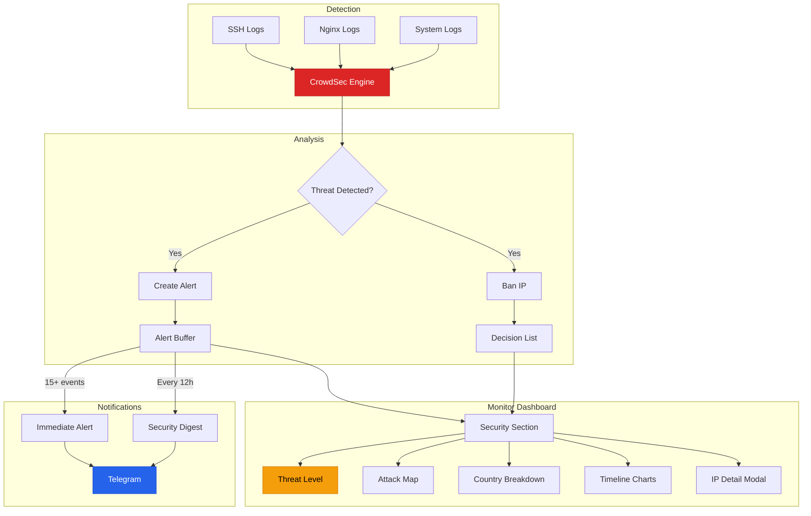
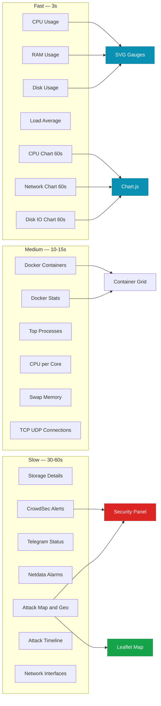

# Server Monitor AI

A self-hosted, real-time server monitoring dashboard with CrowdSec security integration, Docker container tracking, Telegram alerts, and automatic service recovery.

Built as a single-page Node.js application with zero frontend dependencies (vanilla JS + CSS), designed to run on a home server or VPS behind a reverse proxy.

### Dashboard



### Attack Map & Geolocation



---

## How It Works



---

## Alert Flow



---

## Container Auto-Recovery



---

## Security Pipeline



---

## Data Flow & Polling



---

## Features

### System Monitoring
- **CPU** -- Real-time usage with 60-second history chart, per-core breakdown
- **Memory** -- Active/wired/compressed/inactive/free breakdown with visual bar
- **Disk** -- All mount points with usage, I/O rates, and inode stats
- **Swap** -- Usage tracking with visual indicator
- **Network** -- Per-interface traffic (RX/TX) with 60-second history
- **Load Average** -- 1m/5m/15m with progress bars relative to core count
- **Processes** -- Top 15 by CPU/memory usage
- **TCP/UDP Connections** -- IPv4 and IPv6 socket stats

### Docker Container Management
- Live container list with status indicators (running/paused/stopped)
- Per-container stats: CPU%, memory, network I/O, PIDs
- Detailed container modal with ports, env vars, restart policy
- Paginated grid view for large deployments

### Automatic Service Recovery
- Periodically snapshots the list of running containers
- On boot, automatically restarts containers that were running before a server restart
- Manual snapshot and restore via dashboard buttons
- Compose-project-aware: tracks which services belong to which stack

### Security (CrowdSec Integration)
- **Threat Level Indicator** -- Low/Medium/High based on active alerts and bans
- **Alert Feed** -- Recent CrowdSec alerts with scenario names and source IPs
- **Banned IPs** -- Active decisions (bans) with duration
- **Attack Map** -- Interactive Leaflet map with IP geolocation
- **Country Breakdown** -- Origin countries sorted by threat count with flags
- **Attack Timeline** -- Daily (7 days) and hourly (24h) bar charts
- **Scenario Analysis** -- Top attack scenarios with frequency bars
- **IP Detail Modal** -- Click any IP for full info: ISP, org, AS, coordinates, related alerts, ban history

### Alerting (Telegram)
- Real-time alerts via Telegram bot with configurable cooldowns
- **Security Digest** -- 12-hour summary with top scenarios and banned IPs
- **Healthchecks.io** -- Heartbeat every 60 seconds for uptime monitoring
- Test button in dashboard to verify Telegram connectivity

### UI/UX
- Dark and light theme with system preference detection
- Responsive design (mobile, tablet, desktop)
- Apple-style glassmorphism header with backdrop blur
- SVG gauge indicators for CPU/RAM/Disk
- Real-time clock and uptime display
- Password-protected dashboard (Basic Auth or proxy auth headers)

---

## Quick Start

### 1. Clone the repository

```bash
git clone https://github.com/diegoperezg7/server-monitor-AI.git
cd server-monitor-AI
```

### 2. Install Netdata on the host

```bash
bash <(curl -Ss https://my-netdata.io/kickstart.sh)

# Verify
curl http://localhost:19999/api/v1/info
```

### 3. Set up Docker Socket Proxy

```bash
docker network create docker_proxy

docker run -d \
  --name docker-proxy \
  --restart unless-stopped \
  -e CONTAINERS=1 \
  -e INFO=1 \
  -e NETWORKS=0 \
  -e VOLUMES=0 \
  -e IMAGES=0 \
  -e POST=1 \
  -v /var/run/docker.sock:/var/run/docker.sock:ro \
  --network docker_proxy \
  tecnativa/docker-socket-proxy
```

### 4. Set up CrowdSec

```bash
docker volume create crowdsec-config
docker volume create crowdsec-data

cd crowdsec
docker compose up -d

# Register the monitor as a machine
docker exec crowdsec cscli machines add dashboard-monitor --password YOUR_PASSWORD

# Create a bouncer API key (save the output)
docker exec crowdsec cscli bouncers add monitor-bouncer
```

### 5. Configure and launch

```bash
cd ..
cp .env.example .env
# Edit .env with your credentials

docker compose up -d --build
```

Dashboard available at `http://localhost:3002`

### 6. (Optional) Logging stack

```bash
cd logging
docker compose up -d
```

- **Grafana** at `http://localhost:3030`
- **Loki** at `http://localhost:3101`
- Promtail auto-discovers Docker containers

---

## Configuration

### Environment Variables

| Variable | Description | Default |
|----------|-------------|---------|
| `NETDATA_URL` | Netdata API base URL | `http://127.0.0.1:19999` |
| `CROWDSEC_URL` | CrowdSec LAPI URL | `http://127.0.0.1:8081` |
| `CROWDSEC_MACHINE_ID` | CrowdSec machine identifier | `localhost` |
| `CROWDSEC_PASSWORD` | CrowdSec machine password | - |
| `CROWDSEC_BOUNCER_KEY` | CrowdSec bouncer API key | - |
| `NET_INTERFACE` | Network interface to monitor | `en1` |
| `TELEGRAM_BOT_TOKEN` | Telegram bot token from @BotFather | - |
| `TELEGRAM_CHAT_ID` | Telegram chat ID for alerts | - |
| `HEALTHCHECK_PING_URL` | Healthchecks.io ping URL | - |
| `DASHBOARD_URL` | Dashboard URL (included in alerts) | - |
| `DASHBOARD_PASSWORD` | SHA1 hash for Basic Auth | - |
| `DOCKER_HOST` | Docker API endpoint | socket |
| `AUTO_RESTORE_ON_BOOT` | Auto-restore containers on start | `true` |
| `RESTORE_STATE_FILE` | Path to container state file | `data/active-services-state.json` |
| `RESTORE_STARTUP_DELAY_MS` | Delay before auto-restore | `15000` |
| `RESTORE_SYNC_INTERVAL_MS` | Snapshot sync interval | `15000` |
| `RATE_WINDOW_MS` | Rate limit window | `60000` |
| `RATE_MAX_REQUESTS` | Max requests per window | `240` |
| `RATE_BAN_MS` | Temporary ban duration | `900000` (15min) |
| `RATE_LIMIT_BYPASS_IPS` | Comma-separated IPs to bypass rate limit | - |

### Alert Cooldowns

| Alert Type | Cooldown | Trigger Condition |
|------------|----------|-------------------|
| CPU High | 5 min | Above 90% for 2 consecutive checks |
| RAM High | 5 min | Above 90% for 2 consecutive checks |
| Disk High | 15 min | Above 85% |
| Server Down | 1 min | Netdata unreachable 3x |
| Container Down | 2 min | Container stopped |
| Container Restart | 2 min | Container in restart loop |

### Reverse Proxy (Caddy)

```
monitor.yourdomain.com {
    reverse_proxy localhost:3002
}
```

### Reverse Proxy (Nginx)

```nginx
server {
    server_name monitor.yourdomain.com;

    location / {
        proxy_pass http://127.0.0.1:3002;
        proxy_set_header Host $host;
        proxy_set_header X-Real-IP $remote_addr;
        proxy_set_header X-Forwarded-For $proxy_add_x_forwarded_for;
        proxy_set_header X-Forwarded-Proto $scheme;
    }
}
```

---

## API Endpoints

All endpoints require authentication (Basic Auth or proxy headers).

| Method | Endpoint | Description |
|--------|----------|-------------|
| GET | `/api/system` | CPU, RAM, disk, load, uptime, I/O, network |
| GET | `/api/storage` | All disk mount points with I/O and inodes |
| GET | `/api/swap` | Swap memory usage |
| GET | `/api/cpu-cores` | Per-core CPU usage |
| GET | `/api/cpu-history` | 60-point CPU history |
| GET | `/api/net-history` | 60-point network history |
| GET | `/api/io-history` | 60-point disk I/O history |
| GET | `/api/connections` | TCP/UDP connection stats |
| GET | `/api/disk-io` | Disk I/O per device |
| GET | `/api/processes` | Top 15 processes by CPU/memory |
| GET | `/api/network-interfaces` | Network interface details |
| GET | `/api/docker` | Docker container list |
| GET | `/api/docker-stats` | All container stats summary |
| GET | `/api/docker/:id/stats` | Individual container detailed stats |
| GET | `/api/restore-state` | Container restore state and snapshot |
| POST | `/api/restore-state/snapshot` | Force snapshot of running containers |
| POST | `/api/restore-state/restore` | Manually restore containers from snapshot |
| GET | `/api/security` | CrowdSec health, alerts, decisions |
| GET | `/api/security-geo` | Security data with IP geolocation and map |
| GET | `/api/ip-info/:ip` | IP geolocation and attack history |
| GET | `/api/attack-stats` | Attack timeline (daily/hourly) and scenarios |
| GET | `/api/alerts/status` | Alert configuration and history |
| POST | `/api/alerts/test` | Send test Telegram alert |
| GET | `/api/info` | Netdata host info |
| GET | `/api/alarms` | Active Netdata alarms |
| GET | `/api/logs` | System event log |
| GET | `/api/system-info` | Extended system info (OS, kernel, arch) |

---

## Security

- Password-protected dashboard (Basic Auth)
- Proxy auth headers (`X-Auth-User`, `X-Auth-Email`, `X-Auth-Role`) for SSO
- Rate limiting: 240 req/min per IP, 15-min ban on excess
- Security headers: `X-Content-Type-Options`, `X-Frame-Options`, `X-XSS-Protection`
- Docker access via read-only socket proxy (no direct socket mount)
- CrowdSec JWT tokens cached with auto-refresh
- IP geolocation cached 24h, private IPs excluded
- Container env vars filter out PATH/HOME/HOSTNAME

---

## Project Structure

```
server-monitor-AI/
  server.js                    # Express backend (API + monitoring loops)
  public/
    index.html                 # Single-page dashboard (HTML + CSS + JS)
    logo.jpg                   # Dashboard logo
    favicon-*.png              # Favicons
  docker-compose.yml           # Main monitor container
  Dockerfile                   # Node.js Alpine image
  .env.example                 # Configuration template
  crowdsec/
    docker-compose.yml         # CrowdSec IDS container
  logging/
    docker-compose.yml         # Loki + Promtail + Grafana stack
    loki-config.yml            # Loki storage and ingestion config
    promtail-config.yml        # Promtail Docker log scraping config
  data/
    .gitkeep                   # Runtime state directory
```

## Tech Stack

- **Backend**: Node.js 20 + Express 4 (zero other dependencies)
- **Frontend**: Vanilla HTML/CSS/JS (no build step, no framework)
- **Charts**: Chart.js (CDN)
- **Maps**: Leaflet.js (CDN) with CARTO tiles
- **Metrics**: Netdata API
- **Security**: CrowdSec LAPI
- **Containers**: Docker Engine API via socket proxy
- **Geolocation**: ip-api.com batch API
- **Alerts**: Telegram Bot API
- **Uptime**: Healthchecks.io
- **Logging**: Loki + Promtail + Grafana


## License

Copyright (c) 2024-2026 Diego Perez Garcia. All rights reserved.

This repository is published for **portfolio and evaluation purposes only**. You may view and read the contents to evaluate the author's technical capabilities. Copying, modifying, distributing, or using any part of this codebase for any purpose is prohibited without explicit written permission. See [LICENSE](LICENSE) for full terms.
